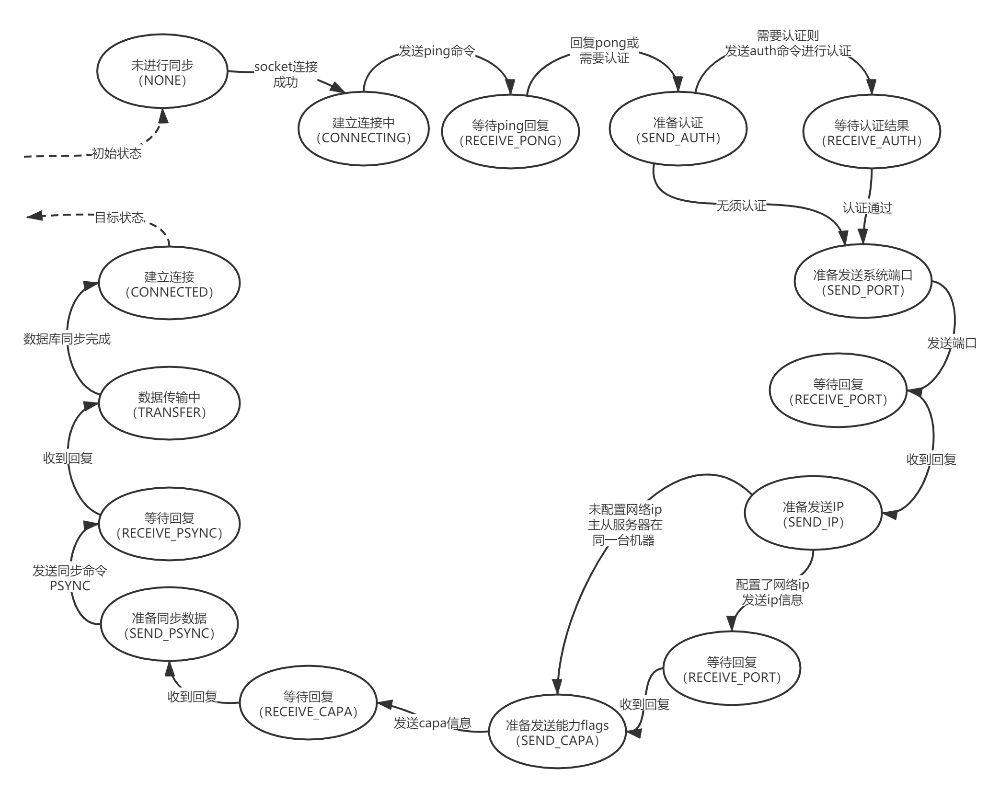
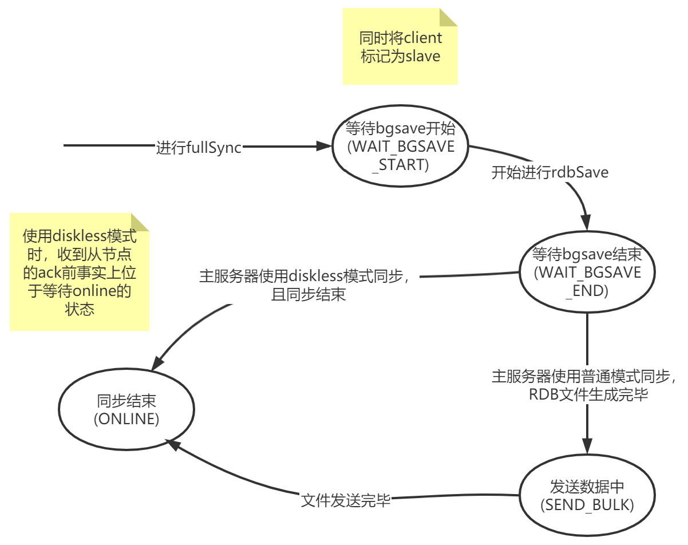

<!-- TOC depthFrom:1 depthTo:6 withLinks:1 updateOnSave:1 orderedList:0 -->

- [Redis设计与实现](#redis设计与实现)
	- [一、数据结构](#一数据结构)
		- [基本数据结构](#基本数据结构)
		- [其他数据类型](#其他数据类型)
	- [二、redis数据库](#二redis数据库)
		- [数据库结构](#数据库结构)
		- [缓存过期删除](#缓存过期删除)
		- [缓存持久化](#缓存持久化)
	- [三、服务器与客户端](#三服务器与客户端)
		- [客户端连接与命令执行](#客户端连接与命令执行)
	- [三、事件机制](#三事件机制)
		- [文件事件](#文件事件)
		- [时间事件](#时间事件)
		- [事件遍历](#事件遍历)
		- [key事件通知（默认关闭）](#key事件通知默认关闭)
	- [四、主从服务器](#四主从服务器)
		- [主从同步](#主从同步)
		- [通过ACK对主从连接进行健康检测](#通过ack对主从连接进行健康检测)
	- [五、哨兵(sentinel)节点](#五哨兵sentinel节点)

<!-- /TOC -->

# Redis设计与实现

> 基于redis仓库提交: [84b3c18f7](https://github.com/KnockHarder/learning-redis)

## 一、数据结构

### 基本数据结构

1. 动态字符串
    - 相关文件: sds.h sds.c
    - 多种长度类型: sdshdx，区别在于结构体首端用于记录buf已用长度与分配长度的整形不同(uint8_t,uint16_t ...)
    - sds由三个部分组成（sdshd5较特殊，而且一般不会使用，这里不考虑sdshd5）:
      - 长度区域：记录字符串占用长度和实际申请空间的长度，sdshdx使用uintx_t记录长度
      - 标记位： 用于区分sds实际使用的类型，固定占用一个字节
      - 内容区：指向实际字符串
    - 动态分配大小，当字符串长度小于1M时，x2增长，否则+1M
    - sds对象使用较为特殊，一般不使用sds类型指针，而是向外传递一`char*`类型指针，直接指向内容。这样可以直接重用相应的操作函数，不必为sds新写输出相关函数，如打印函数
2. 列表-list
    - 相关文件: adlist.h adlist.c
3. 字典-dict
    - 相关文件: dict.h dict.c
    - 通过hash实现，当hash冲突时，使用链表解决，dict会记录hash表长度(length)及总数据数(used)
    - 当哈希冲突超过阈值时，会将hash表扩张至二倍。当dict_can_resize为真时，阈值为used>=length，否则为used / length > dict_force_resize_ratio (默认为5)
    - 扩张后会进行rehash，但该过程为渐进的式的，此时dict会持有两张hash表，第二张（新表）的长度为第一张的二倍。
      每次增删改查时，会扫描旧表对非空节点做数据迁移，当迁移了足够多的hash节点或路过了足够多的空节点时，停止扫描并记录下一次扫描位置。
      迁移完成后，释放旧表，并进行翻转
4. 跳跃表: zskiplist
    - 相关文件: server.h z_zset.c
    - 跳跃表是在普通双向链表的基础上，在每个节点随机生成若干层（层数不小于1不大于32）
    - 当从head向tail遍历时，最下层形成了简单双向链表，节点间span为1，而层i(i>1)的span则记录了距离下一个层i节点的距离
    - zskiplist为每个节点记录分值(score)，zskiplist的排序规则为优先比较score大小，等score的情况下比较sds大小
    - 通过尽可能使用高层进行跳跃式遍历，在N不能远大于`2^32`（32为最高层数）时，查找和插入的平均时间复杂度为O(logN)，最坏O(N)，
      删除操作的时间复杂度为O(1)；当`N >> 2^32`时，跳跃表的优势将下降，最终查找和插入的平均时间复杂度将达到O(N)
    - 如果从head开始从前向后遍历，将途经节点的span值累加，我们可以得到该节点到head的距离，该距离为该节点的rank值。因此除了通过score、sds筛选外，
      zskiplist还允许通过rank筛选我们所需要的值
    - 跳跃表相较有有序数组，性能较差，但不需要一块完整的大的内存空间，且每个节点的大小可以不一致，更加灵活。
      而相较于红黑树，跳跃表的维护更加简单，但需要双倍的空间消耗（仅考虑不满足 N >> 2^32 的情况），但需要事先定好最高层级
5. 整数集合-intset
    - 相关文件: intset.h intset.c
    - 为了节均空间，intset的整数类型尽可能选小，初始使用int16类型。当插入数据超过范围时，再使用较大一级的整型，并扩充空间
    - intset为有序数组，查找时使用二分查找，时间复杂度为O(logN)
    - 每次插入数据都需要扩容，并使用内容拷贝的方式将插入位空出来，时间复杂度与查找一致
    - 需要注意的是intset在节点删除后，并不会尝试更小的数据类型
6. 压缩列表-ziplist
    - 相关文件: ziplist.h ziplist.c\
    - ziplist总体上由三个部分
      1. 头区域——含两个uint_32以及一个u_int16，分别记录ziplist占用总字节数、最后一个条目地址相对于ziplist头地址的偏移、拥有的条目数量
      2. 内容区域——使用连续内存块存放所有的条目，大小随条目增长
      3. 尾区域——只含一个uint_8，并被置为255标记ziplist结束
    - 每个条目已包含三个部分
      1. 前一节点长度区域——用于记录前一节点（地址增加顺序）的长度信息，视长度大小本区域占用1或5个字节（取决是长度能否用1个字节表示）
      2. 编码及长度区域——记录本条目的编码方式及内容值占用字节数量，视编码方式和内容长度占用1/2/5个字节
      3. 内容区域——存储经编码转换后的内容。
    - 编码方式有两种：整数型与字节型，取决于输入内容是否可被作为ASCII码转换为不大于64位的有符号整数
    - 为了最小化使用空间，编码信息与长度进行混合存储，`编码及长度区域`的第一个字节内可能同时包含编码信息和部分长度信息
    - 由于条目的`前一节点长度区域`长度因前一节点长度大小不同可能占用1字节，也可能占用5字节，因此在进行插入和删除操作时，可能会导致可向后传导的对`前一节点长度区域`的修正，
      因此插入与删除动作的时间复杂度为O(n)
    - 因为zipentry同时记录了自身长度及前一节点长度，因此ziplist支持向前向后遍历两种方式

### 其他数据类型

1. 快速列表-qucklist
    - 相关文件: quicklist.h quicklist.c
    - 由以下几个部分组成:
      1. head-头节点指针，tail-尾节点指针
      2. count-总条目数量，len-节点数量。这里两个数量并不一致，count为各node.count的总和。
      3. fill-用于限制单个节点中ziplist大小，默认值为-2，占用14bits。当fill < 0时，通过限制单个ziplist长度的方式控制大小，对应的阈值为optimization_level[-fill-1]；
         当fill >= 0时，单个ziplist中条目数量应小于fill。
      4. ompress-需要压缩的节点的最小深度（距离头节点或尾节点的距离），占用14bits。当列表节点深度低于阈值时，不会对节点进行压缩，
      5. bookmarkcount-记录书签数量，占用4bits。共占用4字节。
      6. bookmarks-书签数组，可以为quicklistNode创建相应的书签，以便快速访问
    - quicklistNode-列表节点
      - 由以下几个部分组成：
        1. prev-指向上一节点，next-指向下一节点
        2. zl-指向压缩列表(ziplist)
        3. sz-压缩列表占用空间大小，unsigned int类型
        4. count-压缩列表中条目数量，16bits的无符号整数
        5. encoding-编码方式，包括raw与lzf压缩两种编码方式，2bits的无符号整数
        6. container-节点携带的数据类型，有NONE与ZIPLIST两种，2bits的无符号整数
        7. recompress-当ziplist因为使用被解压时，需要被重新压缩，这种情况下该值为1。为1bit无符号整数
        8. attempted_compress-标志位，如果之前压缩时因数据过小(小于48节点)无法压缩，该字段置1，1bit的无符号整数
        9. extra-额外保留空间，占用剩余的10bits
    - quicklist相对于ziplist而言，不需要连续的空间，因此可能存储更多的数据。且可对ziplist使用lzf进行压缩，进一步减少空间占用。

2. 有序集合-zset
    - 相关文件: server.h z_zset.c
    - zset由两个部分组成:
      1. dict字典，key是sds，value是score
      2. zskiplist跳跃表，存储内容有sds和score
    - 因此zset通过score和ele进行排序

3. 流对象-stream（内容需要完善）
    - 相关文件: stream.h stream.c
    - 主要用于消息队列
    - 由以下几个部分组成
      1. rax树根节点存储消息
      2. 消息的ID
      3. rax树节点

4. redis对象-robj
    - 相关文件: server.h object.c
    - 总体上由5个字段
      1. type记录数据类型，占用4bits的无符号整数
      2. encoding记录编码方式，占用4bits的无符号整数
      3. lru记录最近使用时间或最近使用频次，占用24bits的无符号整数
      4. refcount记录被持有的计数，int类型
      5. ptr指向实际内容，void*指针
    - 通过数据的最近使用时间或最近使用频次，以及被持有计数，对内存进行回收。当限制内存大小的情况下，如果内存占用过多需要释放对象占用空间时，
      默认使用LRU策略，可通过配置选择使用LFU策略
    - type及对应的编码方式如下:
      - OBJ_STRING: 字符串类型，内容使用sds结构
        - OBJ_ENCODING_RAW编码方式: 为字符串创建sds对象，并将prt指向sds（实际是指向内容区，见上文中对sds的说明）
        - OBJ_ENCODING_EMBSTR编码方式: 此时将申请一段连续空间，将sds直接追加到robj后面的地址空间中。
          当字符串长度小于或等于44时，会使用这种编码方式，可减少一次内存分配操作。用来存放短的只读字符串，修改后会转成raw编码。
        - OBJ_ENCODING_INT编码方式: 当存储数据为int_64时，可以使用该编码方式，此时ptr存储内容为64位有符号整数值（注意直接存储值而不是指针）
      - OBJ_LIST：列表类型，可以正向、反向遍历
        - OBJ_ENCODING_QUICKLIST编码方式: quicklist
        - OBJ_ENCODING_ZIPLIST编码方式: ziplist
        - 实际上已不再使用ziplist，只使用quicklist这一种编码形式
      - OBJ_SET：集合对象
        - OBJ_ENCODING_HT编码方式：使用sds作为key的dict
        - OBJ_ENCODING_INTSET编码方式: intset，当所有元素都是可以用`long long`表示时，使用该类型
        - 只允许由OBJ_ENCODING_INTSET向OBJ_ENCODING_HT升级
      - OBJ_ZSET: 有序集合对象
        - OBJ_ENCODING_SKIPLIST编码方式: zset，可以通过map快速获取节点
        - OBJ_ENCODING_ZIPLIST: ziplist，一个元素需要在ziplist中插入两个片段，分别存储ele和score
        - 当条目数量小，且最大条目长度不超过阈值时，使用ziplist，否则升级为skiplist。在部分操作中也允许降级。
      - OBJ_HASH: 哈希对象
        - OBJ_ENCODING_ZIPLIST: ziplist
        - OBJ_ENCODING_HT: dict实现，使用sds作为哈希的key和value
        - 当哈希表中内容较少时，使用该ziplist，否则升级为dict。不允许降级操作。
      - OBJ_STREAM: 流对象
        - OBJ_ENCODING_STREAM: stream对象，多用于消息机制实现
      - OBJ_MODEL:
        - OBJ_ENCODING_RAW: moduleValue对象，内含moduleType和value两部分，moduleType提供了一系列操作value的函数
    - redis可以根据实际灵活切换编码方式，以优化内存占用和访问速度
    - redis内存储了一些共享对象，如于10000的无符号整数等，用于减少不必要的对象创建

## 二、redis数据库

### 数据库结构

redisServer有多个数据库，在服务启动时，会初始化相应的redisDb对象作为数据库对象。我们可以通过redis-cli中的select命令切换数据库。

redisDb中包含以下几个部分:
1. dict: `dict*`类型。键类型为字符串(sds)，值类型可以为任意类型对象。用于存储键值对。
2. expires: `dict*`类型。键类型为字符串，值类型为64位带符号整数，存储过期时间戳（单位毫秒）。用于通过键找到条目的过期时间。
3. blocking_keys: `dict*`类型。键类型为使用raw编码的字符串对象，值类型为`list`类型。
4. ready_keys: `dict*`类型。键类型为已编码的字符串对象，值类型可以为任意对象类型
5. watched_keys: `dict*`类型。键类型为使用raw编码的字符串对象，值类型为`list`类型。
6. id: `int`类型，数据库的id，为从[0,redisServer.dbnum)中的一个值
7. avg_ttl: 64位有符号整数
8. expires_cursor: 64位无符号整数。配合定期缓存过期任务使用，记录已描述的slot数量。该值只增不减，且dict有两个动态扩容的th，因此实际运行时，需要实时计算访问下标。
9. defrag_later: `list*`类型，元素为`sds`类型。

### 缓存过期删除

- 缓存过期删除通过两种策略配合完成:
  - 惰性删除(db.c/expireIfNeeded): 让需要访问键对象时，判断对象是否过期，如果过期则回收。该策略使垃圾回收只回收需要过期处理的对象，性能较高，但因无法及时清理空间，
    可能会导致内存泄漏。
  - 定期删除(server.c/initServer,serverCron,databasesCron): 每隔一段时间，增量的执行缓存清理工作（类似dict的rehash过程）。该策略可以避免过期对象对空间的过长占用，但由于这种扫描方式的回收性能差，
    因此需要根据实际情况，合理设置清理任务的时间间隔，以及单次任务量。避免CPU过多的占用或者内存的过多浪费。
    - 扫描时，如果当前db的填充率不足1%，则放弃对该db的扫描，避免过多的访问空节点
    - 可通过配置限制垃圾回收任务的CPU使用率，限制垃圾回收的占用时长，计算方式受`server.hz`配置的影响
- 在删除对象时，如果开启惰性释放功能，则(lazyfree.c/dbAsyncDelete)会判断删除对象需要的空间释放次数，如果释放动作过多，则会将释放任务提交到队列中，
  供垃圾回收后台进行空间回收。

### 缓存持久化

- 持久化有两种形式: RDB与AOF
- RDB持久化一般使用dump.rdb文件，文件名可以通过配置文件修改
  - RDB持久化当前数据库中的内容
    - 校验头信息，由9个char组成: `"REDIS"`+`4位版本号`
    - Aux信息
    - 数据库部分
      - 数据库基本信息: id、缓存条目的dict大小、expires的dict大小
      - 缓存条目/其他:
        - 条目属性: 条目的一些额外属性，如过期时间、lru/lfu值等。每条属性由以下两个部分组成:
          - 类型: 占用1字节
          - 属性值: 占用空间大小视随类型不同而变化
        - 条目key值: sds对象
        - 条目value值: 任意对象类型
            - 对象类型: 需要注意的是该类型并不是robj中的type，而是rdb存储时定义的类型。占用一字节。
            - 对象值
    - Aux信息
    - EOF标志
    - 文件校验和: 占用8个字节，64位无符号整数
  - RDB持久化时，即使对象过期，也会写入文件；但读取时，会过滤过期条目（如果当前节点为主节点）。
  - 如果打开了`rdbcompression`功能，则在进行持久化时，会对大内容进行lzf压缩
  - 手动触发RDB持久化，可以通过`SAVE/BGSAVE`命令调用。`FLUSHALL`命令也会进行持久化，但是会清空数据库后再持久化，因此实际上是重置rdb文件。
  - 除此之外，系统也会自动进行持久化备份，当满足下面任意条件时，会触发持久化动作:
    - 1小时内数据库有变化
    - 五分钟内变化条目不小于100
    - 1分钟内变化条目不小于10000
    - redis即将关闭，且未指定不保存数据
- AOF持久化，是一种更频繁的持久化动作，，以保证即时遭遇断电这种极端情况，也能恢复尽可能多的数据。
  - 将在数据库变化时将变化命令输出到aof_buf，在定时任务执行前(beforeSleep)，将缓存区的内容输出到AOF文件（默认为appendonly.aof）
  - 由于现代操作系统中，为提高IO效率，在写文件时往往采用的**延迟写**的策略，写文件操作只是将内容写入缓冲区而不是实际文件。
    因此AOF持久化的写文件另外提供了`appendfsync`控制文件同步(fsync)策略，以在对安全性要求高的场景下保障AOF文件内容的完整性。
      - no: 使用操作系统默认策略
      - everysec: 每秒一次，进行文件同步
      - always: 每次进行写文件操作时，均进行文件同步
  - 由于AOF文件会持续增长，且会记录`DEL`等操作，因此当AOF文件过大，且增强到一定比例后，会进行重写
  - 重写时会根据数据库中的实际情况，以`SET/RPUSH`等命令，记录下各缓存对象。由于单个命令的大小限制，因此在记录集合类型时，
    会控制单个语句的大小(AOF_REWRITE_ITEMS_PER_CMD=64)
  - 重写会创建一个子进程单独执行相关操作，在重写期间新生成的AOF内容会除了定入AOF缓冲区外，还会放入AOF重写缓冲区(aof.c/feedAppendOnlyFile)，
    重写子进程在完成db数据的重写后，会将重写缓存区中的内容写入AOF文件(aof.c/rewriteAppendOnlyFile)。
    在重写进程结束后，发送完成信息(aof.c/rewriteAppendOnlyFileBackground)，主线程之后会再一次将AOF重写缓冲区中的内容定稿AOF文件()，
    完成重写任务(aof.c/backgroundRewriteDoneHandler)。
  - 如果指定了使用RDB的格式进行重写时，那么将以RDB文件的格式进行输出

现在考虑一种场景：redis运行了一段时间，我们发现没有打开AOF功能，现在应该怎么做？

最容易想到的是，修改redis.conf文件，将`appendonly`配置为`yes`，然后restart。然后我们会发现，数据库里的数据全部消失了！

这是因为如果打开了AOF功能，redis启动时会从aof文件中恢复数据，而在重启前AOF功能是关闭状态，并不会生成aof文件，导致无法恢复数据。

因此，正确的做法是通过`CONFIG SET`命令，先将`appendonly`配置切换为`yes`，会立即生成aof文件。
然后修改配置文件中的`appendonly`即可，以保证重启后AOF功能在重启后仍是开启状态，并使用aof文件进行数据恢复。

## 三、服务器与客户端

- redis例中有两个重要的数据结构: redisServer与client
- redis服务的状态保存在redisServer中，因此全局只有一个名为server的实例对象，其中一部分字段的含义如下:
  - db: redisDb数组，redis里有多个数据库，每个数据库即有一下redisDb实例
  - dbnum: 整数，记录数据库数量
  - aof_enable,aof_filename: 是否启用AOF功能，AOF文件名称
  - aof_rewrite_scheduled: 当尝试进行aof重写操作，但已有后台任务在执行时，会将该字段置为真
  - rdb_filename: RDB文件名称
  - 缓存时间: 由于通过系统函数获取当前时间较慢，因此服务器会保存一个缓存时间，用于一些对时间精度要求不高的场合。缓存时间会在每个主循环中更新一次，
    也会在其他特定场景更新，如通过client调用命令时更新一次、数据库从AOF/RDB中恢复时每隔一段时间更新一次(networking.c/processEventsWhileBlocked)。
  - lru_clock: 当前服务器的lru时间。在serverCron执行过程中更新，获取服务器信息时也会更新。
  - stat_net_input_bytes、stat_net_output_bytes、stat_numcommands等统计数据
  - rdb_child_pid、aof_child_pid、module_child_pid: 子进程的pid，同一时间内只会有一个对应的子进程，用于执行一些耗时长的任务。
  - child_info_pipe: int[2]类型，记录通过pipe命令产生的管道线，用于父子进程间通信。
  - clients: 列表对象，用于保存和服务器建立的远程连接信息
  - client_obuf_limits: 各类型client的缓冲区大小限制(normal/slave/replica/pubsub/master)
  - clients_pending_write: 列表对象，当client的输出缓冲区非空，且socket可用时，会登录到该列表中，并在主循环中(beforeSleep)将内容冲刷至socket
- client是用于存储连接信息的数据结构，当和服务器产生连接以进行命令交互时，都会创建一个client，无论是通过网络连接(如redis-cli
  与服务器建立连接)还是通过文件（加载rdb文件时）或其他方式。不同的时，通过socket创建的client会记录到`server.clients`列表中，
  同时为其时创建一个文件事件用于处理请求数据。
- client结构的定义在server.h文件中，下面列举了几个常用的字段
  - id: 身份标识，server维护了一个原子类型的64位整数，每新建一个客户端便进行自增做为新客户端的id。
  - conn: 连接信息
    - 如果是有连接客户端，则记录了连接信息(如tcp/tls文件描述符等)
    - 如果是无连接客户端，则为NULL（也称为fakeClient）。例如在loadDataFromDisk时，使用aof文件恢复数据库时，
      则会生成一个无连接客户端执行aof文件中读取出的命令；redisServer持有的lua_client；自定义模板中用于执行命令的客户端。
  - db: 当前使用的数据库，通过该client传输的查询/赋值等命令都会在该数据库中执行
  - name: 连接名称，默认为NULL，可通过`CLIENT SETNAME`命令为客户端设置名称以方便区分
  - authenticated: 是否通过认证
  - querybuf、qb_pos、querybuf_peak: 读缓冲区，用于存放从conn中读取到的命令，这些命令可能来自于一个三方应用，也可能来源于主节点（主从同步）
  - argc、argv、argv_len_sum: 从querybuf中解析出的命令参数
  - cmd: 从querybuf获取到的命令
  - flags: 记录客户端的角色(slave/master)以及当前的状态
  - buf、bufpos、reply、reply_bytes: 输出缓冲区，一般用于输出查询命令的返回信息，在进行主从增量同步时，也会被主节点用来向从节点同步相关写操作。
    buf为定长的`char*`结构，pufpos记录可写位置；当buf空间不足以满足本次定稿时，会将使用buf中内容初始化一个节点加入到`list*`结构的reply中，
    后续写入内容直接写到尾节点中，buf不再使用。当尾节点大小不能超过限制时，会将尾节点写满后将剩余内容创建一个新节点存储，并加入list中。
  - ctime、lastinteraction: 客户端创建时间、最后一次与服务器交互的时间
  - obuf_soft_limit_reached_time: 输出内容第一次达到软限制的时间
    - 这里的大小指: 已发送内容大小 + 缓冲区内容大小(当一次循环无法及时将内容发送完时会记录已发送数据大小)
    - 软/硬限制、超出软大小限制时长限制可通过`client-output-buffer-limit`配置
    - 如果大小超过硬性限制，客户端将被关闭；如果超过软性控制，且持续时间(如果中间某段时间回落则重新计算)超过时间限制，客户端将被关闭。

### 客户端连接与命令执行

- 服务器通过client接收到命令后，在执行命令前会做一些检查，如果不满足要求，则拒绝执行。检查内容包括
  - 命令是否存在
  - 参数个数是否正确
  - 客户端是否通过权限校验
  - 是否需要进行空间回收，回收后是否有足够内存
  - 如果命令会造成数据变更，数据持久化流程是否正常（看最近一次持久化结果）
  - 当前服务器、客户端的身份是否适合执行该命令
  - 其他
- 在执行命令后，同样会执行一些操作，包括:
  - 记录慢查询日志
  - 命令调用记录加一、记录调用耗时
  - 添加AOF记录
  - 如果当前服务器为主服务器，需要将命令执行后的状态同步到其他服务器
- 执行命令产生的回复会追加到输出缓冲区中，并将client登记至server.clients_pending_write列表中，
  最终在`beforeSleep`过程将缓冲区中内容进行冲刷到连接方，每次主循环只会冲刷一部分内容。
  - 执行命令时，如果出现异常情况，返回内容以'-'开头，正向的返回内容以'+'开头
- 普通客户端的关闭可以由于以下几个原因:
  - 网络连接中断
  - 请求格式错误、请求内容长度超限
  - 被KILL
  - 长时间空转
  - 输出缓冲区中内容长度超过限制——包括超过硬性大小限制或超过软件大小限制一定时间

## 三、事件机制

Redis的是一个事件驱动程序，事件分为两种类型:
- 文件事件: 服务器与客户端通过socket连接，文件事件是对socket的抽象，进行读写操作。
- 时间事件: 对定时操作的抽象。

### 文件事件

- 文件事件使用多路复用实现: 服务器同时接收多个客户端连接，但通过单进程单线程的方式处理，该线程会遍历就绪的文件事件逐个进行处理，达到多路复用的效果。
  多路复用底层实现有多个，但对上层提供统一接口(函数定义)，redis在编译时会选择其中一个实现。
- 文件事件类型分为可读(READABLE)、可写(WRITABLE)两种类型，当一个事件同时可读写时，默认先处理读事件后处理写事件，
  如果指定事件类型为AE_BARRIER，则先处理写事件后处理读事件。
- 下面是几个常见的文件事件
  - Redis在启动时，会监听配置的接口，并创建相应的文件处理器，作为套拼字(tcp/tls/unixSocketFile)的事件处理器，用来接收并执行命令
  - 创建client(networking.c/createClient)时，通过connSetReadHandler配置处理逻辑(networking.c/readQueryFromClient)，
    并将事件监听加入eventLoop中(connection.c/CT_Socket,connSocketSetReadHandler)
  - readQueryFromClient在执行命令时，会生成返回信息，添加返回信息加时会将客户端记录到server.clients_pending_wirte中
    (networking.c/prepareClientToWrite)，在before_sleep中被输出到发出请求的客户端。

### 时间事件

- 时间事件分为一次性事件与循环事件，区别在于事件函数的返回值，如果返回`-1`则该事件执行一次后被置为删除状态（下一次主循环时删除），如果为正数x，则表示每隔x秒执行一次。
- 事件机制的处理逻辑在aeMain主循环中进行，文件事件优先于时间事件处理（获取文件事件的最大阻塞时间不超过距离最近一个时间事件的时间），因此时间事件的执行时间往往要稍晚于设定时间。
- redis启动时会初始化一个用于维护服务器状态的时间事件，对应的执行函数为serverCron，时间间隔为1秒

### 事件遍历

- Redis的事件遍历在主循环aeMain中
- 各个事件应尽可能少的占用时间，避免出现对资源的长时间占用，因此每个事件的需要控制单次循环的任务量，对于处理事件较长的任务，可以创建子进程进行。

### key事件通知（默认关闭）

- 可以通过事件消息的方式，通知键值上的操作，该功能可以通过配置`notify-keyspace-events`打开，并通过`SUBSCRIBE`命令监听相应的事件
- 需要注意的是，这里实际上是通过`观察者模式实现`，因此需要先有观察者注册后(pubsub.c/pubsubSubscribeChannel,pubsub.c/pubsubPublishMessage)，
  才会产生发消息的动作。不要误将其当成`生产者-消费者`模式理解。

## 四、主从服务器

- 在redis中，可以通过`SLAVEOF`将当前服务器设置为另一个服务器的拷贝，被拷贝服务器称为`主(master)服务器`，拷贝服务器称为`从(slave)服务器`。
- 从节点不会直接删除过期键，而是等到主节点的`DEL`消息时才会删除键。在此之前，如果客户端获取命令为非只读，非会返回过期数据。

### 主从同步

- 使用sync/psync进行全量主从同步时，从服务器的master.repl_state状态变更如下:

- 使用sync/psync进行全量主从同步时，主服务器维护的slave的client.repl_state状态变更如下:

- redisServer与client中服务于主从同步的字段
  - redisServer:
    - master: 当前节点为从节点时，会持有一个连接到主节点的连接——当前节点可以同时为主节点和从节点，主从节点是相对的，主节点是从节点的复制。
    - repl_state: 当前节点为从节点时，主从连接状态，状态定义以`REPL_STATE`前缀的宏定义常量
    - slaves: 列表对象，登记与从节点建立的连接
    - replid: 当前节点为从节点时，记录根主节点的运行时id——一级节点下还可以有二级从节点，该id为根部节点的server.replid（根节点在初始化时随机生成）
    - master_repl_offset: 当前节点为从节点时，记录已从主节点复制的数据偏移量，用于增量同步。当前节点为主节点时，记录已发送同步的数据偏移量。
      当该节点既为主节点也为从节点时，实际上有两层含义。（这里的偏移量与实际数据量无关，偏移量随同步递增，仅用作确认从节点是否落后于主节点。）
    - repl_transfer_xxx: 进行全量的主从同步时会使用
    - repl_backlog: 缓存的同步数据，用于增量同步。由于缓存时占用空间有限（可配置），当增量同步时，需要同步的数据量超过缓存空间长度后，
      会退化到全是同步，因此需要根据机器配置和业务实际情况配置。
    - master_initial_offset: 当前节点为从节点时，每次进行全量同步后，更新该值为主节点的server.master_repl_offset，
      用于在全量同步后，初始化server.master
  - client:
    - flags: 记录客户端的角色(slave/master)以及当前的状态
    - replstate: 身份为slave时，用于标记当前同步状态，状态是以`SLAVE_STATE`为前缀的宏定义常量
    - psync_initial_offset: 身份为slaver时有效，记录进行fullSync时的server.master_repl_offset。在等待bgsave期间，
      如果有新的从节点想进行fullSync，直接将其加入到等待bgsave的列表，并将该值返回给从节点，重置从节点的master_initial_offset。
    - reploff: 身份为master时有效，记录标记从主节点已同步的数据量，供后续进行增量同步时使用。
- diskless模式:
  - 主从同步过程中，服务端有两种模式传输数据
    - 普通传输模式下，会先fork出子进程生成rdb文件，文件生成后，将文件大小和文件内容通过socket传输到从节点
    - diskless传输模式下，由于将rdb持久内容输出到socket（实际通过pip由两个进程完成）,无法提前知道文件大小，
      因此通过EOF标志作为内容传输结束的标志。
  - 从节点通过第一行数据识别出传输模式进行数据接收。从节点进行数据库重置时，也有两种模式或供选择
    - 普通模式下，会逐步将接收到的内容存入rdb文件，全部接收完毕后通过rdb文件重置数据库
    - diskless模式下，会清空数据库，并直接将socket配置为阻塞模式，边接收数据边更新数据库
  - 需要注意的是，主从数据库可以使用不同的模式。其中主数据库通过`repl-diskless-sync`配置发送模式，
    从数据库通过`repl-diskless-load`配置数据加载模式。
- 除了全量同步外，还有增量的同步
  - 被动的增量同步: 在主节点执行造成数据库变化的命令时，也会直接将命令同步到各从节点(server.c/propagate,
    replication.c/replicationFeedSlaves)
  - 主动的增量同步(psync):
    - 在replicationFeedSlaves方法中可以看到，除了将命令发送给已建立连接的从节点外，还会将其输出到repl_backlog中
    - 如果某个从节点掉线后重连，这时会发送`psync`命令，携带`replyid`（上一次连接的主服务器id）
      和`reply_offset`（已同步数据总和）两个参数；主服务器在接收到`psync`后，判定该从节点只需要进行增量同步即可时，
      会从repl_backlog中取出未同步的部分，返回给从服务器。
- 主从同步期间，propagate时只会将内容输出到缓冲区，等待client变为online状态后，才会真正发送数据

### 通过ACK对主从连接进行健康检测

- 为从节点服务器在运行serverCron时(replication.c/replicationCron)，会向主节点发送`REPLCONF ACK`命令。
  主节点接收到命令后，会相应client.repl_ack_time更新为当前缓存时间，并更新client.repl_ack_off为从节点中记录的reploff
- 如果服务器配置了`repl-min-slaves-max-lag`与`repl_min_slaves_to_write`，那么主节点可以借助ack_time进行健康检测
  - `repl-min-slaves-max-lag`配置了client(slave)两次ack之前的最小间隔，如果超过该时间，认定为连接异常(replication.c/replicationCron)
  - 当创建的连接数据少于`repl_min_slaves_to_write`时，将拒绝执行会导致数据库变化的命令(server.c/processCommand)，
    因为此时主节点已无法及时将变化同步至从数据库。

## 五、哨兵(sentinel)节点

主从复制提供了数据的分布式存储方案，但当主节点不可靠时，由于从节点不能进行写操作，导致所有的节点都无法正常使用。
为此可以将某个节点标记为哨兵节点，哨兵节点可以监听多个主服务器，当某个被监视的主服务器进行下线状态时，哨兵节点将从其下属的从节点中选择一个，
做为新的主节点。

- 哨兵模式启动时，必须指定配置文件，在redis运行过程中，运行时的配置（可能变化）会覆盖原配置文件的配置
- 由于哨兵模式不使用数据库，因此启动时不会加载rdb/aof文件
- 哨兵模式下，会使用另一套完全不同的命令(server.c/initSentinel)，且会初始化一个名为`sentinel`的全局变量用作记录口哨兵节点的状态
- sentinelState结构体部分字段:
	- myid: 哨兵节点的ID，启动时随机生成(sentinel.c/sentinelIsRunning)
	- announce_ip、announce_port: 对外ip和端口
	- current_epoch: 当前纪元
	- masters: dict类型，被监听的主节点
	- tilt: 是否打开了tilt模式，tilt会在主循环两次时间间隔过长或服务器启动时间过长时打开
	- tilt_start_time: tilt模式打开时间
	- previous_time: 上一次进行主循环的时间，服务启动时被初始化为启动时间
	- running_scripts: 当前正在执行的脚本数量
	- scripts_queue: 脚本队列
	- simfailure_flags: 失败原因宏定义以`SENTINEL_SIMFAILURE`为前缀
	- deny_scripts_reconfig: 是否禁止通过`SENTINEL SET`命令修改脚本路径
	- failover_timeout: failover动作的超时时间
- 配置文件中，可以通过`sentinel moniotr <name> <host> <port> <quorum>`配置监听的主节点基本信息，并通过`sentinel xxx`对`sentinelRedisInstance`中部分属性进行配置
- 被监听的节点的信息用`sentinelRedisInstance`存储，部分信息如下:
	- flags: 当前身份及状态
	- name: 名称
	- runid: id
	- sentinelAddr: ip地址
	- instanceLink: 连接信息
	- quorum: 被至少多少个哨兵判定为主观下线时，进入客观下线状态
	- role_reported: 当前身份
	- role_reported_time: 身份确认时的时间
	- sentinels: master身份有效，记录正在监听该主服务器的其他哨兵
  - slaves: master身份有效，记录与该主节点连接的从节点
	- slave_conf_change_time: slave身份有效，master地址变化的时间
	- master_link_down_time: slave身份有效，记录与主节点断开连接的时间
	- mstime_t slave_reconf_sent_time: slave身份有效，记录切换主节点的时间
	- master: slave身份有效，指向主节点的`sentinelRedisInstance`
	- slave_master_host,slave_master_port: slave身份有效，主节点的ip和port
	- slave_master_link_status: slave身份有效，与主节点的连接状态
- 哨兵模式下会在serverCron中调用`sentinelTimer`函数，完成哨兵节点的维护任务
	- 检查是否需要打开tilt状态(sentinel.c/sentinelCheckTiltCondition)
	- 重新连接已断开的与master之间的连接(sentinel.c/sentinelHandleDictOfRedisInstances)
	- 对主节点、主节点的slaves节点的连接进行健康检查
	- 检测需要重新选举主节点、投票选出进行迁移操作的从节点作为leader，由leader进行迁移
- 哨兵节点会与其监听的主节点、主节点下的从节点建立连接，且每个连接含有两个socket，均以异步的处理方式运行
	- 用于传输命令的socket连接——通过该连接与各节点交互
	- 用于订阅hello channel的连接——与上文中提到的**key事件通知**原理一样
		- 各哨兵节点在启动时，会订阅其监听的主节点、主节点下的从节点、主节点相关的哨兵节点上的hello频道
		- 每个哨兵节点会定时在这些频道上发布自己的信息和状态，用与监控同一主节点的哨兵节点间进行状态同步及leader选举
- 哨兵节点间不建立命令连接，只有消息连接

### 主节点故障迁移

当哨兵节点检测到主节点故障后，会从节点中选举出一个新的主节点，原主节点退化为从节点

- 故障检测
	- 故障检测通过ping命令与info命令进行，哨兵节点会定时向各主从节点发送ping命令与info命令，如果长时间无响应或响应异常（条件可配置），
	  将该节点认定为**主观**下线状态
	- 当有多个哨兵节点监控同一主节点时，检测到故障的哨兵节点会询问其他哨兵是否也检测到了该节点的下线——各节点对异常的容忍度可能因配置而不同，
	  因此即使网络正常，也可能出现各哨兵节点对是否下线的判定不一样的场景，因此单节点只能得到主观的下线状态判定结果。
	- 当有超过一半的哨兵节点认定该主节点已下线时，则将该节点认定为**客观**下线状态，开始准备进行故障迁移
- 选举决策者(leader)
	- 在正式进行迁移前，需要从这些哨兵中选举出一位决策者，由其主导迁移工作
	- 决策者的选取遵循以下规则:
		- 每个哨兵持有epoch用于记录自己经历过的选举次数，听其他哨兵传言也算经历——当得到其他哨兵的epoch时，如果自己的偏小，会更新自己的epoch
		- 每个哨兵会定时通过hello频道，交换自己的信息，其中包括此时自己拥有的epoch
		- 发现节点故障（客观）的哨兵，会在向其他哨兵讯问对主节点下线的主观判断时，要求该节点投票选举leader，规则如下:
			- 假设A节点要求B节点投票
			- 如果B节点已经参与过投票，则只有在A的epoch大于原leader（leader可以是B），且不少于B节点时，才将票投给A，否则维持原票
			- 如果B节点未参与过投票，那么只要A的epoch不少于B节点，那么就将票投给A，否则弃权。
			- A节点要求B投票时会告知自己的epoch，所以此时B可以更新epoch，但B的epoch并不会返回给A，如果A未被投票其epoch也不变
		- 当拿到其他哨兵的投票结果后，就将投票结果进行统计（算上自己的一票，相差为1时倾向于原leader），如果某个节点获取超过半数的选票，其当选为leader，否则继续选举
		- 统计票数后，如果统计节点的epoch相对于**初次**选举没变化，将其加一已增加先发现者的优势——相对**初次**加一，如果仍失败不再加一了。
	- 从规则中可以看出:
		- 故障优先发现者有优势: 因为同等epoch下，其将先获取到leader头衔，后来者的epoch必须大于它，才可以取代
		- 能够快速计票都有优势: 如果初次选举未有超过1/2票的候选人，先统计完票的节点，由于其epoch加一，第二次选举会有优势
- 故障迁移
	- leader挑选一个slave节点做为新的master节点
		- 跳过网络状态差的节点
		- 剩余节点按优先级、与主节点的同步程度、runid排序，取第一个
	- 将挑选出的salve节点升级为master节点
	- 将其他salve节点的master更换至新节点，并要求各哨兵更新至新结构
	- 将原master节点加入新节点的salves中，新节点完全替换旧节点，结束迁移

## 六、集群

Redis集群是Redis提供的分布式数据库方案，集群通过分片(sharing)来进行数据共享，并提供复制和故障转移功能。

- 可以配置`cluster-enabled`启用集群方案，服务器在启动时，会初始化server.cluster(server.c/clusterInit)。需要注意的是只有主节点允许建立集群
- cluster配置文件可通过`cluster-config-file`指定，如果该配置文件不存在，会创建该文件
- server.cluster的数据类型为`clusterState`，部分字段如下:
	- myself: 当前节点的信息
	- nodes: 集群中的所有节点
	- currentEpoch: 当前纪元，用于故障迁移
	- state: 集群状态(OK/FAIL)
	- size: 集群中有效主节点数量
	- nodes_black_list:
	- migrating_slots_to: 正在将本节点的分片迁移至其他节点，存储迁移目标节点
	- importing_slots_from: 正在将其他节点的分片迁G移至本节点，存储持有分片的节点
	- slots,slots_keys_count,slots_to_keys: 集群中的分片所在节点、分片中拥有的key数量、分片里的所有key值
	- failover_auth_time,failover_auth_sent,failover_auth_rank,failover_auth_epoch,cant_failover_reason:
  - mf_end,mf_slave,mf_master_offset,mf_can_start: 主节点manualFailover时timout时间、触发mf的salve节点、
  - lastVoteEpoch:
  - todo_before_sleep: 在beforeSleep中需要完成的任务
  - stats_bus_messages_sent,stats_bus_messages_received,failover_auth_count: 已发送、接收到的各类型消息的数量，收到failover_auth消息的数量
  - stats_pfail_nodes: 状态为PFAIL的节点数量
- 集群节点的信息在服务器中用struct clusterNode表示，其部分字段:
	- ctime: 服务器中创建该节点对象的时间
  - ip,port,cport: ip、端口、集群端口
  - name: 节点名称。各节点在初始化时生成在一串随机字符，生成后便不会改变
  - flags: 节点身份(master/slave)和状态
  - configEpoch: 配置纪元，用于通过消息沟通各节点存储的集群信息
  - slots,numslots: 当前节点负责的分片及数量
  - slaves,numslaves: 从节点数组及数组大小
  - slaveof: 身份为slaver时有效，记录从节点的名称
  - ping_sent,pong_received: ping发送时间与pong响应时间。当收到 pong 响应时，会重置 ping 的时间为0
  - data_received: 最后一次从该节点收到消息的时间
  - fail_time: 进入failover状态的时间
  - voted_time: 最后一次投票的时间
  - repl_offset,repl_offset_time: 节点的repl_offset值，更新repl_offset的时间
  - link: 集群使用的连接相关信息，使用`clusterLink`结构体
  - fail_reports: 被其他节点判定为异常的记录，当超过一半的集群节点认定该节点异常时，将进入failover状态
- 集群消息通过一个额外的端口进行监听，端口值为服务器端口加上10000。集群消息的统一使用clusterMsg结构，其组成成员如下:
	- sig: 消息开头标记，固定为`Rcmb`
  - totlen: 消息总长度，单位字节
  - ver: 消息版本，必须使用同一个版本。宏定义版本号为`1`
  - sender,myip,port,cport: 发送节点的名称、ip、端口、集群端口
  - type: 消息类型
  - currentEpoch: 发送方的epoch信息
	- configEpoch: 发送方主节点的configEpoch，更新集群分片信息时如果冲突，会根据该值判断分片属于哪个节点
  - offset: 发送方记录的主节点的repl_offset值
  - myslots: 当前节点负责的分片
  - slaveof: 当前节点为从节点时有效，记录主节点名称
  - flags: 发送节点的flags
  - state: 集群状态
  - mflags: 手动failover状态标记
  - data,count: 消息内容及消息数量，消息内容的实际类型根据`type`不同而变化
- 同哨兵模式一样，集群的定时任务也在serverCron中，定时任务的函数名称为`clusterCron`，除此之外，在beforeSleep中也会根据`server.cluster->todo_before_sleep`
	做一些工作。

### 加入集群、集群节点间的握手(handshake)

- 通过`cluster meet`命令将B节点加入当前节点A的集群中，此时将会创建B节点的node对象，并置为 handshake 和 meet 状态
- 随后两个节点开始进行握手
	- A节点在 clusterCron 中，尝试与B节点的集群端口(cport)建立连接，连接建立后开始握手，发送 meet 消息，meet消息中带有当前集群中部分节点的信息(Gossip)
	- B接收到 meet 消息后，同样创建A节点的node对象，并置为 handshake 状态；根据 Gossip 部分更新集群信息；同时返回 pong 消息，pong消息中同样带有部分集群节点的信息
	- A节点收到 pong 消息后，更新B节点的名称，并结束握手
	- B节点在 clusterCron，尝试与A节点的集群端口(cport)建立连接，连接建立后开始握手，发送 ping 消息，ping消息中带有当前集群中部分节点的信息
	- A节点在收到 ping 消息后，更新集群信息，并返回 pong 消息
	- B节点在收到 pong 消息后，更新A节点的名称，并结束握手
- 上述过程中，虽然B是被动加入A的集群，但加入后两个集群间会同步信息，实际上也就合并成了一个集群

### 健康检测 + 信息同步

- clusterCron会在每10个循环时，随机挑选5个集群中的已建立连接的节点，从中选择距最近一次接收 pong 消息最长时间节点，发送ping命令
- clusterCron的每次循环中，会遍历各节点，如果节点连接超时则断开连接，否则在超时时间内发送 ping 消息。
- 由于 ping 与 pong 消息带有各节点储存的集群信息，因此通过心跳维护，同时实现了集群信息的同步
- 当前服务器A与某个节点B的连接请求/响应超时，B节点被标记为`PFAIL`状态
- 当超过一半的主节点将某个节点标记为`PFAIL`状态后，该节点被标记为`FAIL`状态（类似于哨兵模式中的客观下线）

### 分片

- Redis集群通过分片的方式来保存数据库键值对，集群中共16384(CLUSTER_SLOTS)个分片，数据库的每个键都落座中其中一个槽，
	集群中的每个节点可以处理 0~CLUSTER_SLOTS 个槽。
- 当配置`server.cluster_require_full_coverage`配置打开时，若任一槽没有节点处理或节点下线时，整个集群位于下线状态。该配置关闭时，当有一半的节点下线时，集群位于下线状态。
- 当某节点发送集群消息时，会在消息中携带该节点的master节点的slot信息，这样各节点通过消息沟通，同步集群的分片情况，以便在执行命令时将其指派至正确的节点。
- 集群模式下每个节点只有一个数据库`server.db[0]`，不允许切换数据库；且部分命令只能获取本节点的键值信息，如`KEYS`命令
- 由于集群是用分片的方式进行存储，如果单个命令有多个keys值，且跨实例，那么命令将无法执行。比如分别通过执行`SET nameA valueA` `SET nameB valueB`，两个值被分配(hash)至了不同分片，
	然后希望通过`MGET nameA nameB`的方式同时获取到两个值。
	- 由于在hash时如果key值中有花括号`{}`，会使用第一对花括号中的内容而不是整个key值进行哈希，这样可以用来满足要求某些键值被放在一个master中的场景
- 分片的迁移需要通过多个命令完成，包括`cluster setslot`为分片标记状态，`cluster getkeysinslot`获取分片中的key，以及`migrate`迁移键值对。实际官方提供了用**ruby**语言写的集群管理工具**cluster-trib**，
	通过该工具的`reshard`命令可以一键迁移
